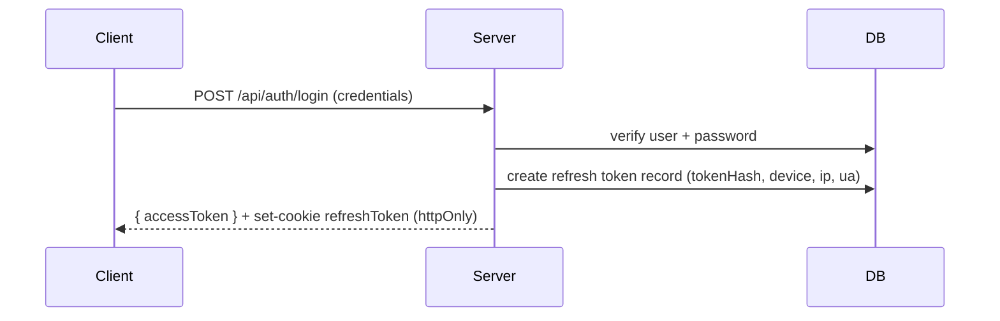
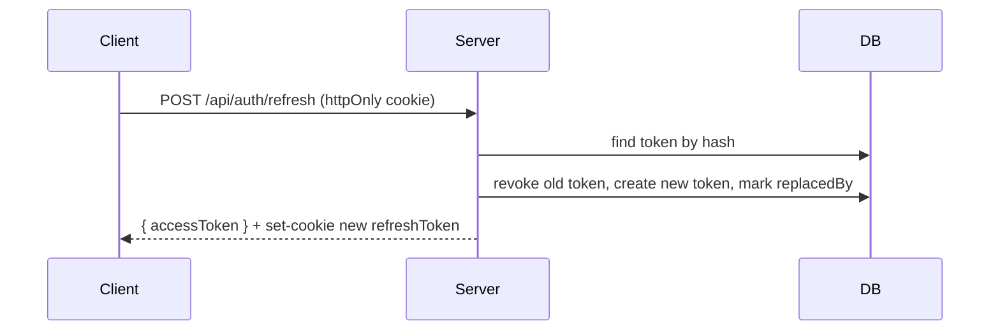

# Authentication Architecture

This document summarizes the authentication foundation: access tokens, refresh tokens, rotation, revocation, and session management.

## Key points
- Access tokens: short-lived JWTs (default 15 minutes), signed with `JWT_SECRET`.
- Refresh tokens: long-lived opaque tokens (default 30 days), stored hashed in DB, rotated on use, tied to device/ip/user-agent.
- Refresh tokens are set as `httpOnly` cookies and never exposed to JS.
- On each refresh the old refresh token is revoked and replaced by a new one (rotation).

## Configuration
All auth-related constants live in `src/config/auth.ts` and are driven by environment variables:

- `JWT_SECRET` — secret for signing access tokens
- `ACCESS_TOKEN_EXPIRES_IN` — e.g. `15m`
- `REFRESH_TOKEN_TTL_DAYS` — e.g. `30`
- Cookie options: `COOKIE_SECURE`, `COOKIE_SAMESITE`, `COOKIE_DOMAIN`, `COOKIE_PATH`
- `SALT_ROUNDS` — bcrypt salt rounds

## Sequence: Login



## Sequence: Refresh



## API Endpoints
- `POST /api/auth/register` — register
- `POST /api/auth/login` — login (returns access token and sets refresh cookie)
- `POST /api/auth/refresh` — rotate refresh token and return new access token
- `POST /api/auth/logout` — revoke current refresh token and clear cookie
- `POST /api/auth/logout-all` — revoke all refresh tokens for authenticated user
- `GET /api/auth/sessions` — list active sessions for authenticated user
- `DELETE /api/auth/sessions/:id` — revoke specific session

## Authorization

See the Authorization documentation for role and permission rules: [AUTHORIZATION.md](docs/AUTHORIZATION.md)
## Running DB migration
After updating `prisma/schema.prisma`, run:

```bash
npx prisma generate
npx prisma migrate dev --name add_refresh_token_fields
```

This updates the Prisma client and creates the migration.
